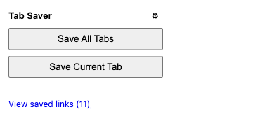
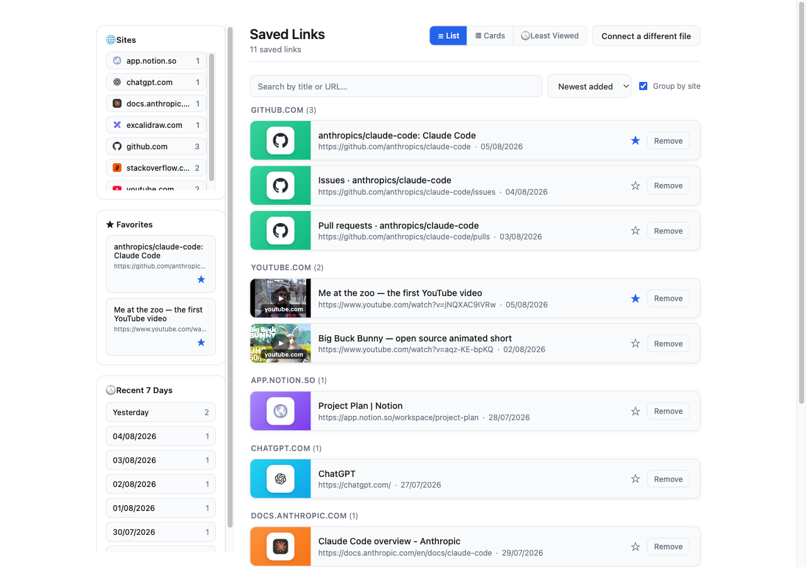
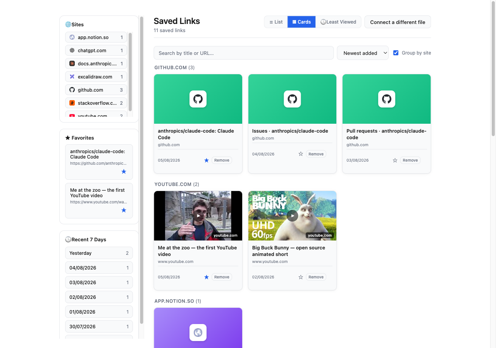

# Tab Saver

**Language:** English | [简体中文](docs/zh/README.md)

A Chrome extension that saves open tabs' URL and title into a single local
JSON file, and lets you browse, organize, and remove saved links from a
manager page.

## Screenshots

| Popup | Manager — List view |
| --- | --- |
|  |  |

**Manager — Card view**



## Requirements

- **Google Chrome 116+** (or another Chromium-based browser with the File
  System Access API enabled). The File System Access API is what lets the
  extension read from and write to a real file on disk — it is not
  available in Firefox or Safari.
- **Manifest V3** extension — no separate runtime or build step is needed;
  it loads directly as an unpacked extension.

## Permissions

Declared in `manifest.json`:

- **`tabs`** — lets the extension read the URL and title of your open tabs
  (so they can be saved) and close a tab after saving it, if you enable
  that option. Tab Saver never reads page content, only tab metadata.

No `downloads` or host permissions are required. Access to the saved-links
JSON file is granted separately, per file, through the browser's native
file picker (File System Access API) — not through `manifest.json`.

## Load the extension

1. Open `chrome://extensions`.
2. Enable "Developer mode" (top-right toggle).
3. Click "Load unpacked" and select this project's folder.

## Usage

> For a detailed, screenshot-illustrated walkthrough, see the
> [User Guide](docs/user-guide.md).

### First-time setup

1. Click the Tab Saver toolbar icon.
2. Click "Save All Tabs" or "Save Current Tab" — since no file is
   connected yet, this opens a file picker to create or choose the JSON
   file that will store your saved links, then saves immediately. You'll
   be prompted a second time to optionally pick a backup file — its
   contents mirror the main file on every save/remove, and you can skip
   it by cancelling that picker.
   (Alternatively, you can connect a file ahead of time from the manager
   page: click "View saved links", then "Connect a file" to open a JSON
   file you saved in an earlier session — or "Create a new one instead" if
   you don't have one yet.)

### Saving tabs

- From the popup, click **"Save All Tabs"** to save every open tab across
  all windows, or **"Save Current Tab"** to save just the active tab.
  Tabs whose URL is already saved are skipped. Only `http(s)` tabs are
  saved — internal `chrome://` pages are ignored.
- Open the settings panel (⚙ icon in the popup) to turn on **"Close tab
  after saving"**, which closes each tab immediately after it's saved.

### Managing saved links

Open the manager page ("View saved links" in the popup, which also shows
a live count of saved links) to:

- **Browse** links grouped by domain, in **List** or **Card** view
  (toggle in the header; your choice is remembered). List view now shows a
  small cover thumbnail for each link too (a real thumbnail for YouTube
  videos, a colored icon tile for everything else) — the same style used in
  Card view.
- **Search** by title or URL — filters across whichever view is active.
- **Sort** by newest added, oldest added, or title A→Z / Z→A (dropdown next
  to search; your choice is remembered). Not shown in Recent 7 Days or Least
  Viewed, which have their own fixed order.
- **Group by site** (checkbox next to sort, on by default) — uncheck it to
  turn off domain grouping and see every saved link sorted together in one
  flat list, in the order your sort dropdown says. Turning off grouping is
  also remembered; the Sites index re-enables it automatically when you
  click a site, since jumping to a group needs one to jump to.
- Click a letter in the **A-Z index** on the right edge (List/Cards view) to
  jump straight to the first link whose title starts with that letter —
  switches to ungrouped, title-sorted view if needed. Click **"#"** to
  scroll back to the top.
- **Sites index** (left sidebar, above Favorites) — lists every distinct
  domain you've saved links from (e.g. "github.com", "youtube.com"), each
  with a favicon and a count. Click one to jump straight to that domain's
  group further down the page.
- **Favorite** a link (★ button) to pin it in the left-hand sidebar, where
  favorited links can be **drag-reordered**. Favorites also sort to the
  top of their domain group, and domain groups containing a favorite sort
  above groups that don't.
- **Recent 7 Days** (left sidebar, below Favorites) — lists the most recent
  dates that have saved tabs (skipping any day with none, reaching further
  back as needed to show up to 7 dates), nearest first. Click a date to
  filter the main list down to just that day's tabs; click it again to
  clear the filter.
- **Least Viewed** view — a third view mode showing the 5 saved links
  you've opened the fewest times (ties broken by the oldest save date
  first), a quick way to resurface things you saved and forgot about.
  Opening a link (from any view) records the open.
- **Remove** a link with its "Remove" button. When a domain group's last
  link is removed, the group disappears.
- **Bulk-select and delete** — hover over a link (List or Card view) to
  reveal a checkbox in its top-left corner; check a few to select them (the
  checkbox stays visible once checked, even without hovering). A bar
  appears above the list showing how many are selected, with **Delete
  selected** (asks for confirmation — this can't be undone) and **Cancel**
  to clear the selection.
- **Connect a different file** (header button) to switch which file the
  manager reads from and writes to — opens a file picker for choosing an
  existing JSON file (not a save dialog), so it always loads that file's
  existing links instead of risking an accidental blank one.

Tab Saver is the sole intended writer of the connected JSON file. If the
connected file is unparseable, or is valid JSON that doesn't match the
expected `{ "links": [...] }` shape (e.g. it points at some other, unrelated
`.json` file), the extension detects this and refuses to write — it will
never merge tabs into it or overwrite it.

## Run the unit tests

```bash
npm test
```

Tests cover the pure logic modules (`src/linkMerge.js`, `src/tabsToEntries.js`,
`src/linksFile.js`, `src/filterLinks.js`, `src/groupByDomain.js`,
`src/favorites.js`, `src/leastViewed.js`). The browser-only `src/storage.js`
(File System Access API + IndexedDB) is verified manually — see
`docs/superpowers/specs/2026-07-31-tab-saver-design.md` for the manual test
checklist.
