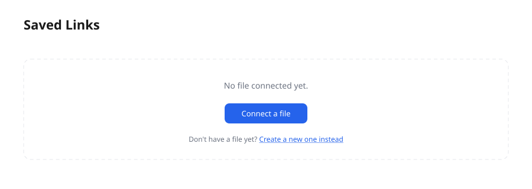
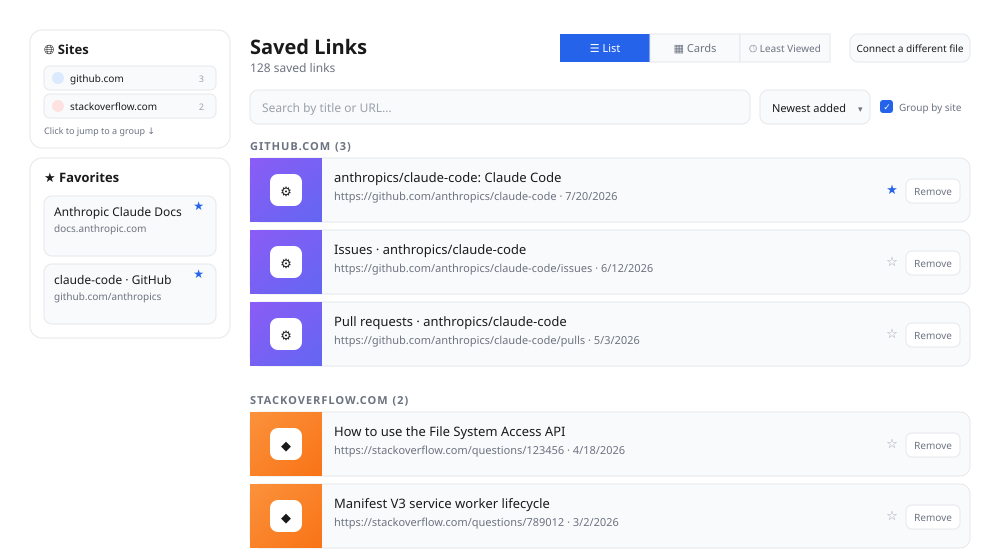
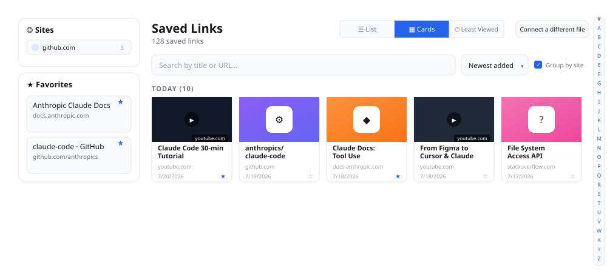
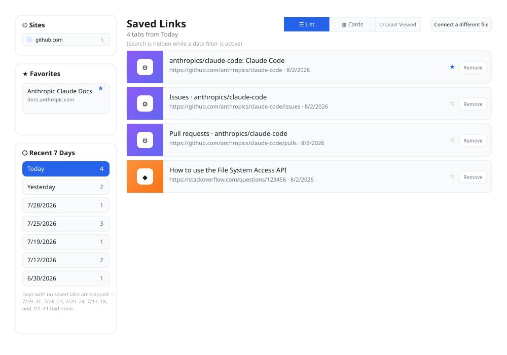
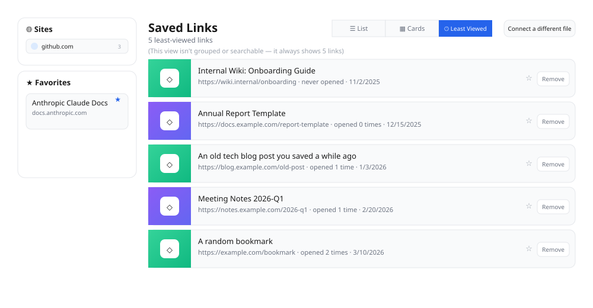

# Tab Saver User Guide

**Language:** English | [简体中文](zh/user-guide.md)

Tab Saver is a Chrome extension that saves the tabs you have open (URL +
title) into a local JSON file on your own computer, and gives you a manager
page to browse, search, favorite, organize, and remove those saved links
afterward.

> 📌 Note: the screenshots in this guide are illustrations drawn to match
> the extension's real styling, meant to show where each feature lives and
> what it looks like — the actual page may differ in small details.

---

## Table of Contents

- [Tab Saver User Guide](#tab-saver-user-guide)
  - [Table of Contents](#table-of-contents)
  - [What this extension does for you](#what-this-extension-does-for-you)
  - [Before you install](#before-you-install)
  - [Load the extension](#load-the-extension)
  - [First use: connect a save file](#first-use-connect-a-save-file)
  - [Saving tabs](#saving-tabs)
    - [Setting: close tab after saving](#setting-close-tab-after-saving)
  - [Browsing and managing saved links](#browsing-and-managing-saved-links)
    - [Sites index](#sites-index)
    - [List view](#list-view)
    - [Card view](#card-view)
    - [Sorting](#sorting)
    - [Group by site](#group-by-site)
    - [Multi-select and bulk delete](#multi-select-and-bulk-delete)
    - [Favorites and drag-to-reorder](#favorites-and-drag-to-reorder)
    - [Recent 7 Days sidebar](#recent-7-days-sidebar)
    - [Least Viewed view](#least-viewed-view)
    - [Connecting a different file](#connecting-a-different-file)
  - [FAQ](#faq)
  - [Privacy](#privacy)

---

## What this extension does for you

- Save the **current tab** with one click, or **save every open tab** at
  once.
- Everything is stored in **a local JSON file you choose** — nothing is
  uploaded to any server.
- A manager page lets you:
  - Browse links **grouped by domain**, so everything saved from the same
    site sits together;
  - **Search** by title or URL;
  - Browse in either **List** or **Card** view;
  - **Favorite** important links, pin them in a sidebar, and drag to
    reorder them;
  - Jump straight to a recent day's tabs via the **Recent 7 Days** sidebar
    list;
  - Check the **Least Viewed** view to quickly find links you saved and
    never opened again;
  - **Remove** links you no longer need.

---

## Before you install

- Requires **Google Chrome 116+** (or another Chromium-based browser with
  the File System Access API). That API is what lets the extension read
  from and write to a real file on your disk — Firefox and Safari don't
  support it yet.
- The extension requests exactly one browser permission: **reading tab
  info** (to get the URL/title of your open tabs, and to close a tab after
  saving it if you turn that option on). It **never** reads page content,
  and never requests access to all your websites.
- Read/write access to your save file is granted separately, through
  Chrome's native "choose a file" picker — this is independent of the
  permission you grant when installing the extension itself, so the
  extension never automatically gets access to arbitrary files on your
  disk.

---

## Load the extension

Since this extension isn't published on the Chrome Web Store yet, it needs
to be loaded manually:

1. Type `chrome://extensions` in the address bar and press Enter.
2. Turn on **"Developer mode"** (top-right toggle).
3. Click **"Load unpacked"** and select this project's folder.
4. Once loaded, the Tab Saver icon appears in the browser toolbar. If you
   don't see it, click the puzzle-piece (Extensions) icon in the toolbar
   and pin Tab Saver.

---

## First use: connect a save file

The first time you use it, the extension isn't linked to any file yet — you
need to choose (or create) one yourself as the place your links get saved
to.

1. Click the Tab Saver toolbar icon, then click **"View saved links"** to
   open the manager page.
2. The manager page will say "No file connected yet" — click **"Connect a
   file"**.

   

3. In the system file picker that opens, create or choose a `.json` file
   (e.g. `saved-tabs.json`) to use as the main file.
4. A second file picker will pop up right after, to optionally choose a
   **backup file**. If you'd like an automatically-mirrored backup, pick or
   create one; if not, just click "Cancel" to skip this step — it won't
   affect the main file at all.

Once connected, the manager page automatically reads from this file every
time you open it — **you won't need to connect again**, unless you switch
computers, or Chrome resets the permission after reloading the extension
(see [FAQ](#faq) below).

---

## Saving tabs

Click the Tab Saver toolbar icon to open a small popup:

- **Save All Tabs**: saves every tab open across all of your browser
  windows. Tabs whose URL is already saved are skipped automatically. Only
  regular web pages (`http://` / `https://`) are saved — internal
  `chrome://` pages are ignored.
- **Save Current Tab**: saves just the tab you're currently viewing.
- After saving, the popup shows how many tabs were saved and how many of
  those were new.
- **"View saved links (number)"**: click to open the manager page; the
  number in parentheses is your current total saved-link count, so you
  always know how much you've saved.

### Setting: close tab after saving

Click the gear icon ⚙ in the top-right of the popup to expand the settings
panel:

Turning on **"Close tab after saving"** means every time you click "Save
All Tabs" or "Save Current Tab", the corresponding tab(s) close
automatically right after being saved successfully — handy for quickly
"saving and clearing out" a batch of tabs you don't want to look at right
now but don't want to lose either. This setting is remembered the next time
you open the extension.

---

## Browsing and managing saved links

Click "View saved links" in the popup to open the manager page. It's split
into a left sidebar (**Sites** index, **Favorites**, and **Recent 7 Days**)
and a **main content area** on the right.

### Sites index

At the top of the left sidebar, "🌐 Sites" lists every distinct domain
you've saved links from — each entry shows a favicon, the domain name, and
how many links it has (see the sidebar in the List view screenshot below).

Click a site to jump straight down to that domain's group in the main list
(clearing any active search or date filter first, so the group is always
visible). This is a quick way to get to a specific site's links — e.g. all
your saved GitHub issues, or Notion pages — without scrolling.

### List view

List view is the default — links are automatically **grouped by domain**,
each with a small cover thumbnail:

- The total saved-link count is shown at the top of the page.
- The search box at the top filters by **title or URL**; both views
  (List/Card) share the same search results.
- Each link shows a cover thumbnail on the left — a real video thumbnail for
  YouTube links, or a colored icon tile (favicon on a gradient background)
  for everything else, same as Card view.
- Each group's header shows how many links that domain has, e.g. "GITHUB.COM
  (3)". When the last link in a group is removed, the group disappears
  automatically — no empty groups are left behind.
- Each link has two buttons on the right:
  - ★ / ☆: click to add or remove it from favorites.
  - **Remove**: permanently removes this link from the saved list (this
    doesn't affect any page you already have open — it just removes the
    record).
- Favorited links automatically move to the front of their domain group;
  if any link in a group is favorited, that whole group also sorts ahead
  of other groups, so what matters to you surfaces first.

### Card view

Click **"▦ Cards"** at the top to switch to a card grid layout — still
grouped by domain, but each link is shown as a compact card with a cover
image side by side, for a more visual, tile-based way to browse. YouTube
links show the video's real thumbnail with a site-name badge; other links
show a colored gradient tile with the site's favicon centered in a white
icon badge:

Your view choice is remembered, so the manager page opens in whichever view
you used last.

### Sorting

Next to the search box, the sort dropdown controls the order links appear
in within each domain group, in both List and Card view:

- **Newest added** (default)
- **Oldest added**
- **Title A→Z**
- **Title Z→A**

Your choice is remembered. The dropdown is hidden in Recent 7 Days and Least
Viewed, since those views use their own fixed ordering.

### Group by site

Next to the sort dropdown, the **"Group by site"** checkbox is on by
default, which is what keeps links organized into per-domain groups.
Uncheck it and the domain grouping disappears — every visible link (after
search) is shown in a single flat list or grid, ordered purely by whatever
the sort dropdown says. This is the way to get a true A→Z (or newest-first,
etc.) ordering across *all* your links, not just within one site's group.

Your choice is remembered. Clicking an entry in the Sites index
automatically turns grouping back on if it was off, since jumping to a
domain's group only makes sense when groups exist.

### Multi-select and bulk delete

Hover over any link — in List or Card view — and a checkbox appears in its
top-left corner. Check a few links to select them; a checked box stays
visible even after you move the mouse away, so you can keep building up a
selection across the page (and across a search or a "Group by site"
toggle).

Once at least one link is selected, a bar appears above the list showing
how many are selected, with two buttons:

- **Delete selected** — asks for confirmation, then removes every selected
  link in one write. This can't be undone.
- **Cancel** — clears the selection without deleting anything.

### Favorites and drag-to-reorder

Click the ☆ next to any link to add it to favorites — it will also appear
in the "★ Favorites" sidebar on the left. Every card in the favorites
sidebar supports **dragging with the mouse**, so you can reorder them
however you like (e.g. drag the most important one to the top); the new
order is saved automatically once you drop it. Click the ★ on a card again
to remove it from favorites.

### Recent 7 Days sidebar

Below the Favorites sidebar, the **"🕓 Recent 7 Days"** box lists the most
recent dates on which you saved at least one tab:

- Each row shows a date ("Today", "Yesterday", or the full date) and how
  many tabs were saved that day.
- Days with zero saved tabs are skipped entirely — if your 3 most recent
  days have nothing saved, the list reaches further back in time until it
  has 7 dates with at least one tab.
- Click a date to filter the main list down to just that day's tabs (search
  is hidden while a date filter is active). Click the same date again to
  clear the filter and return to your normal view.
- Switching to List, Cards, or Least Viewed clears any active date filter.

### Least Viewed view

Click **"🕓 Least Viewed"** at the top to switch to a special view that
only shows the **5 saved links you've opened the fewest times**.

- The extension records an "open count" every time you click through to a
  saved link — whether from List view, Card view, or the favorites
  sidebar.
- This view picks out the 5 links with the lowest open count; when several
  links tie on open count (e.g. none of them have ever been opened), it
  prioritizes the **oldest saved** ones first — a quick way to dig up
  things you saved and then forgot about.
- This view is a fixed "spotlight list" — it doesn't support search and
  isn't grouped by domain.

### Connecting a different file

If you want to switch files (e.g. you switched computers, or want to
switch to a different set of saved links), click **"Connect a different
file"** in the top-right of the page and go through the [connect a
file](#first-use-connect-a-save-file) flow again.

---

## FAQ

**Q: The manager page says "Access to your previously connected file was
lost." What do I do?**
A: This is normal — for security, Chrome asks you to reconfirm file access
permission every time the extension is reloaded or updated; it doesn't mean
your data was lost. Click **"Grant access"** as prompted to reconfirm, and
your file and its saved links are unaffected. Only if it still won't open
after granting access do you need to click "Connect a file" to pick again.

**Q: Where is my data stored? Does it sync to the cloud or get uploaded
anywhere?**
A: Everything is stored only in the JSON file you chose on your own
computer. The extension never uploads anything, and has no account or
cloud-sync feature.

**Q: Can the same URL get saved twice?**
A: No. Saving deduplicates by URL — a link that's already saved is skipped,
so you never end up with duplicate entries.

**Q: What happens if I accidentally corrupt the saved file (e.g. a manual
edit gone wrong)?**
A: Before writing, the extension checks whether the file's content still
matches the expected format. If it finds the file is no longer in a
recognizable shape (e.g. it was changed into a different JSON structure, or
the content is corrupted), it refuses to write any further — to avoid
overwriting or polluting the file — and shows you a warning on the manager
page. At that point you can connect a new file, or manually repair the
existing one.

**Q: What is the backup file for?**
A: The backup file is optional. If you chose one when first connecting a
file, the extension writes an identical copy of the main file's contents
to it every time you save or remove a link — an extra safety net (e.g. in
case something goes wrong with the disk or cloud sync where the main file
lives).

---

## Privacy

Tab Saver doesn't collect, upload, or share any of your browsing data. It
does exactly two things: read the URL and title of tabs you chose to save,
writing them to the local file you selected; and record an open count
whenever you click a saved link, used for the Least Viewed view. Everything
stays on your own computer.
