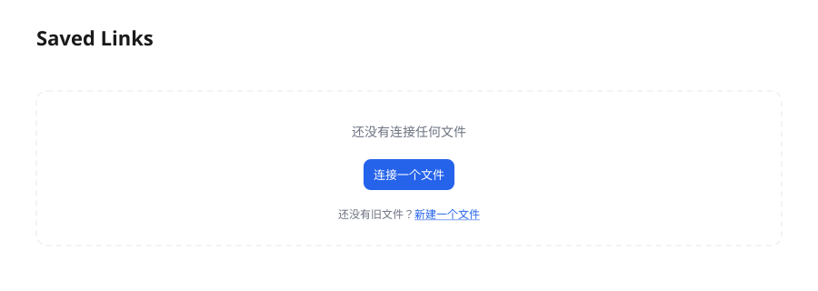
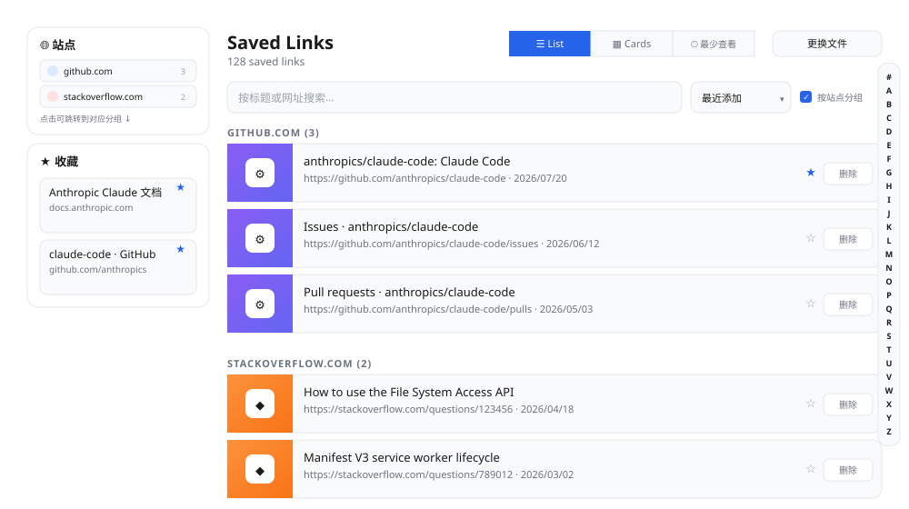
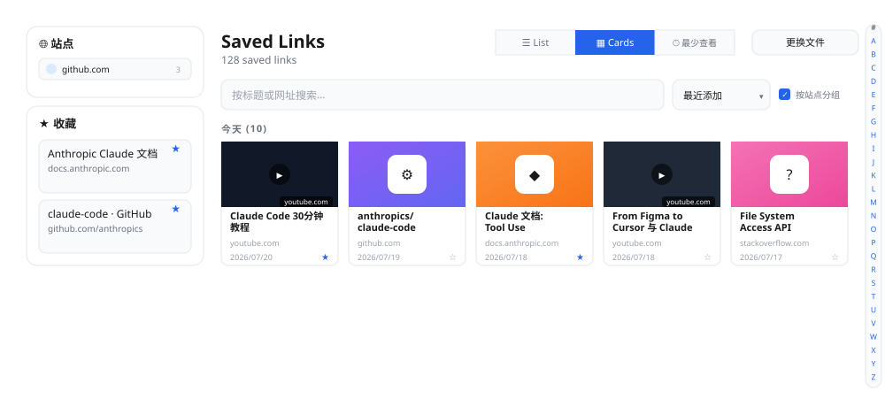
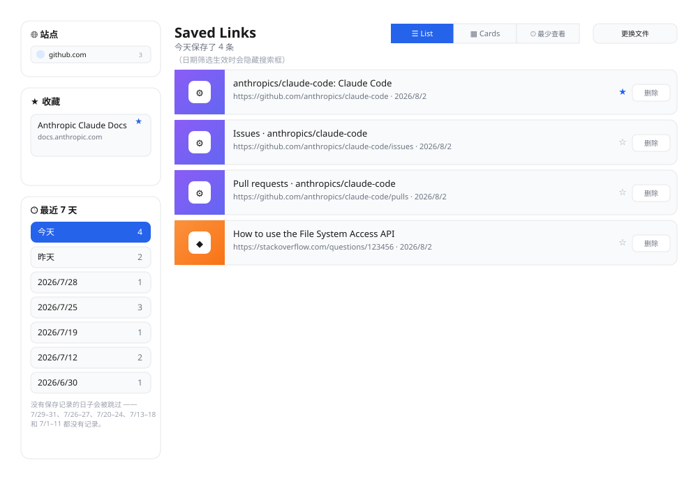
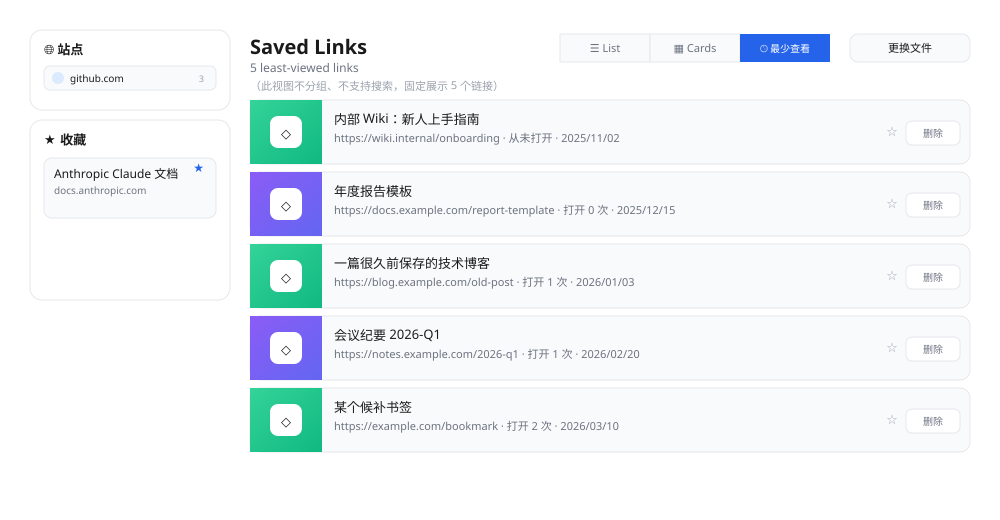

# Tab Saver 使用指南

**Language:** [English](../user-guide.md) | 简体中文

Tab Saver 是一个 Chrome 浏览器插件，帮你把当前打开的标签页（网址 + 标题）保存到你自己电脑上的一个本地 JSON 文件里，并提供一个管理页面，方便你之后浏览、搜索、收藏、整理和删除这些保存下来的链接。

> 📌 说明：本指南中的界面图为示意图（按插件真实样式绘制），用于说明各功能的位置和效果，与你实际看到的页面可能有细微差异。

---

## 目录

1. [这个插件能帮你做什么](#这个插件能帮你做什么)
2. [安装前需要知道的事](#安装前需要知道的事)
3. [加载插件](#加载插件)
4. [首次使用：连接一个保存文件](#首次使用连接一个保存文件)
5. [保存标签页](#保存标签页)
6. [浏览和管理已保存的链接](#浏览和管理已保存的链接)
7. [按字母跳转](#按字母跳转)
8. [常见问题](#常见问题)
9. [隐私说明](#隐私说明)

---

## 这个插件能帮你做什么

- 一键保存**当前标签页**，或者**一次性保存所有打开的标签页**。
- 所有数据保存在**你自己指定的本地 JSON 文件**里，不上传到任何服务器。
- 提供一个管理页面，可以：
  - 按**域名分组**查看，方便找到同一个网站下保存的所有链接；
  - **搜索**标题或网址；
  - 用**列表**或**卡片**两种视图浏览；
  - **收藏**重要链接，并把它们固定在侧边栏，还能拖动调整顺序；
  - 通过**最近 7 天**侧边栏列表，快速跳转到某一天保存的标签页；
  - 查看**最少查看**视图，快速找到你保存后一直没再打开过的链接；
  - **删除**不再需要的链接。

---

## 安装前需要知道的事

- 需要 **Google Chrome 116 及以上版本**（或其他基于 Chromium、支持"文件系统访问 API"的浏览器）。这是保存文件到本地磁盘所依赖的浏览器能力，Firefox 和 Safari 目前不支持。
- 插件只申请了一项浏览器权限：**读取标签页信息**（用于获取你打开的标签页的网址和标题，以及在你开启"保存后自动关闭标签页"时关闭标签页）。插件**不会**读取网页内容，也不会请求访问你所有网站的权限。
- 保存文件的读写权限是通过 Chrome 原生的"选择文件"弹窗单独授权的，与安装插件时的权限申请是两回事——插件本身不会自动获得访问你磁盘上任意文件的权限。

---

## 加载插件

由于这是一个开发中的插件，尚未上架 Chrome 网上应用店，需要手动加载：

1. 在地址栏输入 `chrome://extensions` 并回车。
2. 打开页面右上角的**"开发者模式"**开关。
3. 点击**"加载已解压的扩展程序"**，选择本项目所在的文件夹。
4. 加载成功后，浏览器工具栏会出现 Tab Saver 的图标。如果没有显示，点击工具栏上的拼图图标（扩展程序），把 Tab Saver 固定到工具栏。

---

## 首次使用：连接一个保存文件

第一次使用时，插件还没有关联任何文件，需要你手动选择（或新建）一个文件作为"保存链接的地方"。最简单的办法就是直接试着保存一下：

1. 点击工具栏上的 Tab Saver 图标，再点击**"保存全部标签页"**或**"保存当前标签页"**。
2. 由于还没有连接任何文件，这时会立即弹出系统文件选择框——新建或选择一个 `.json` 文件（例如 `saved-tabs.json`）作为主文件。
3. 紧接着会再弹出一次文件选择框，用来选择一个**备份文件**（可选）。如果你希望有一份自动同步的备份，选一个文件或新建一个即可；如果不需要，直接点击"取消"跳过这一步就行，不会影响主文件的使用。
4. 用你刚才选好的文件，标签页会立刻保存进去。

连接完成后，以后每次使用弹出面板或打开管理页面都会自动读取这个文件，**不需要重复连接**（除非你换了电脑，或者 Chrome 重新加载了插件导致授权失效，见下方[常见问题](#常见问题)）。

你也可以提前连接文件（先不保存任何内容），在管理页面操作：

1. 点击工具栏上的 Tab Saver 图标，再点击**"查看已保存的链接"**，打开管理页面。
2. 管理页面会提示"还没有连接任何文件"，点击**"连接一个文件"**。

   

3. 按上面同样的步骤选择文件即可。

---

## 保存标签页

点击工具栏上的 Tab Saver 图标，会弹出一个小面板：

- **保存所有标签页**：把当前浏览器所有窗口里打开的标签页，全部保存下来。已经保存过的网址会自动跳过，不会重复保存。只会保存普通网页（`http://` / `https://`），像 `chrome://设置` 这类浏览器内部页面会被自动忽略。
- **保存当前标签页**：只保存你当前正在看的这一个标签页。
- 保存后，面板下方会显示这次"保存了几个、其中几个是新的"。
- **"查看已保存的链接 (数字)"**：点击打开管理页面；括号里的数字是当前一共保存了多少条链接，方便你随时了解保存的总量。

### 设置：保存后自动关闭标签页

点击弹出面板右上角的齿轮图标 ⚙，可以展开设置面板：

勾选**"保存后自动关闭标签页"**后，每次点击"保存所有标签页"或"保存当前标签页"，对应的标签页在保存成功后会被自动关闭——适合用来快速"保存并清理"一批暂时不看、但又不想直接关掉丢失的标签页。这个设置会被记住，下次打开插件依然生效。

---

## 浏览和管理已保存的链接

点击弹出面板里的"查看已保存的链接"，打开管理页面。管理页面分为左侧边栏（**站点索引**、**收藏**、**最近 7 天**）和右侧的**主内容区**。

### 站点索引

左侧边栏最上方的"🌐 站点"列出了你保存过链接的所有不同域名，每一项显示网站图标、域名和该域名下的链接数量（可参考下方列表视图截图里的侧边栏）。

点击某个站点，会自动清空当前的搜索或日期筛选，然后直接跳转到主列表中对应的域名分组。这是快速定位某个网站下所有链接（比如所有 GitHub issue、所有 Notion 页面）的捷径，不用手动滚动查找。

### 列表视图

默认是列表视图，链接按**域名自动分组**显示，每条链接都带一个小封面缩略图：

- 页面顶部会显示保存的链接总数。
- 顶部的搜索框可以按**标题或网址**关键字过滤，两种视图（列表/卡片）共用同一个搜索结果。
- 每条链接左侧会显示一个封面缩略图——YouTube 链接显示真实视频缩略图，其他链接显示彩色渐变图标块（favicon + 渐变背景），和卡片视图的封面风格一致。
- 每个分组标题会显示该域名下有多少条链接，例如 "GITHUB.COM (3)"；当一个分组里最后一条链接被删除时，这个分组会自动消失，不会留下空分组。
- 每条链接右侧有两个按钮：
  - ★ / ☆ ：点击可以把这条链接加入或移出收藏。
  - **删除**：从保存列表中永久移除这条链接（不会影响你已经打开的网页，只是从记录里删掉）。
- 已收藏的链接会自动排到所在分组的最前面；如果一个分组里有任意一条被收藏的链接，这个分组本身也会排到其他分组前面，方便优先看到你在意的内容。

### 卡片视图

点击顶部的**"▦ Cards"**按钮，可以切换成卡片网格布局，同样按域名分组，只是每条链接以带封面图的小卡片形式并排展示，适合喜欢更直观、图块化浏览方式的场景。YouTube 链接会显示视频的真实缩略图和站点名称标签；其他链接则显示彩色渐变占位图，中间是一个白色图标框，里面放着网站的 favicon：

切换视图后，你的选择会被记住，下次打开管理页面会自动使用你上次选的视图。

### 排序

搜索框旁边的排序下拉菜单，可以控制每个域名分组内链接的排列顺序，列表视图和卡片视图都适用：

- **最近添加**（默认）
- **最早添加**
- **标题 A→Z**
- **标题 Z→A**

你的选择会被记住。"最近 7 天"和"最少查看"视图不会显示这个下拉菜单，因为它们有各自固定的排序方式。

### 按站点分组

排序下拉菜单旁边有一个**"按站点分组"**复选框，默认是勾选的，这就是让链接按域名分组显示的开关。取消勾选后，域名分组会消失，所有（经过搜索过滤后）可见的链接会打平成一个列表或网格，纯粹按排序下拉菜单选的方式排列。想要真正的全局 A→Z（或最近添加优先等）排序，而不是只在某个站点分组内排序，就取消这个勾选。

你的选择会被记住。点击站点索引里的某个站点时，如果分组是关闭的，会自动重新打开分组，因为跳转到某个域名分组的前提是分组必须存在。

### 按字母跳转

在列表视图或卡片视图下，页面右侧边缘会出现一个 A-Z 字母索引。点击某个字母，即可直接跳转到第一个以该字母开头的已保存链接标题——没有匹配标题的字母会显示为灰色不可点击。如果当前视图还没有按字母排序，点击字母会先自动切换为**未分组、"标题 A→Z"**排序，再跳转。

点击索引顶部的 **"#"** 可以回到页面顶部，不会改变你当前的排序或分组设置。

Least Viewed（最少查看）视图下不会显示 A-Z 索引；索引也会根据当前的搜索关键词过滤——如果你输入了搜索内容，只有匹配结果中存在的字母才可以点击。

### 多选批量删除

把鼠标悬停在任意一条链接上（列表或卡片视图都可以），左上角会出现一个复选框。勾选几条链接后，即使鼠标移开，勾选过的复选框也会一直显示，方便你在翻页、搜索、切换"按站点分组"的过程中持续累积选中项。

只要选中了至少一条链接，列表上方就会出现一个提示条，显示已选中几条，并提供两个按钮：

- **Delete selected**（删除所选）——会弹窗确认，然后一次性删除所有选中的链接，且无法撤销。
- **Cancel**（取消）——清空当前选中项，不删除任何内容。

### 收藏与拖动排序

点击任意一条链接右侧的 ☆，就会把它加入收藏，同时出现在左侧的"★ 收藏"侧边栏里。收藏区里的每张卡片都支持**鼠标拖动**，可以按你自己的习惯重新排列顺序（比如把最重要的拖到最上面），松开鼠标后顺序会自动保存。再次点击卡片上的 ★，即可把它移出收藏。

### 最近 7 天侧边栏

在收藏侧边栏下方，**"🕓 最近 7 天"**区域列出最近有保存过标签页的日期：

- 每一行显示一个日期（"今天"、"昨天"或完整日期）和当天保存的标签页数量。
- 没有保存任何标签页的日子会被完全跳过——如果最近 3 天都没有保存记录，列表
  会往更早的日期继续查找，直到凑够 7 个有保存记录的日期为止。
- 点击某个日期，可以把主列表筛选为只显示那一天保存的标签页（筛选生效时会
  隐藏搜索框）。再次点击同一个日期，即可取消筛选，回到正常视图。
- 切换到列表、卡片或最少查看视图时，会自动清除当前生效的日期筛选。

### 最少查看视图

点击顶部的**"🕓 最少查看"**按钮，会切换到一个特别的视图：只显示 **5 条你打开次数最少的链接**。

- 插件会记录你每次点击打开某条保存的链接（不管是在列表、卡片视图还是收藏侧边栏里点开的），累计一个"打开次数"。
- 这个视图会挑出打开次数最少的 5 条；如果多条链接打开次数相同（比如都还没打开过），就优先展示**保存时间最早**的那些——帮你翻出"当初保存了、后来一直忘记看"的链接。
- 这个视图是一个固定的"精选列表"，不支持搜索、也不按域名分组。

### 更换连接的文件

如果你想换一个文件（比如换了电脑、想切换到另一份保存记录），点击页面右上角的**"更换文件"**按钮，重新走一遍[连接文件](#首次使用连接一个保存文件)的流程即可。

---

## 常见问题

**Q: 打开管理页面，提示"之前连接的文件访问权限已丢失"，怎么办？**
A: 这是正常现象——Chrome 出于安全考虑，每次重新加载/更新插件后都会要求重新确认一次文件访问权限，并不代表你的数据丢失了。按提示点击**"授权访问"**按钮重新确认一下即可，你的文件和其中保存的链接不会受影响。如果授权后仍然打不开，才需要点击"连接一个文件"重新选择。

**Q: 保存的数据存在哪里？会不会同步到云端或者被上传？**
A: 所有数据只保存在你自己电脑上选择的那个 JSON 文件里，插件不会联网上传任何内容，也没有账号或云同步功能。

**Q: 同一个网址会不会被重复保存？**
A: 不会。保存时会按网址去重，已经存在的链接会被跳过，不会产生重复记录。

**Q: 保存的文件被我不小心改坏了（比如手动编辑出错），会有什么影响？**
A: 插件在写入前会检查文件内容是否符合预期格式。如果发现文件已经不是插件能识别的格式（比如被改成了别的 JSON 结构，或者内容损坏），插件会拒绝继续写入，避免覆盖或污染文件，并在管理页面提示你。这时可以选择重新连接一个新文件，或者手动修复该文件的内容。

**Q: 备份文件是干什么用的？**
A: 备份文件是可选的。如果你在首次连接文件时选择了备份文件，插件之后每次保存或删除链接时，都会把和主文件完全一样的内容再写一份到备份文件里，作为一层额外的安全保障（比如主文件所在磁盘/云盘同步异常时，还有备份可用）。

---

## 隐私说明

Tab Saver 不会收集、上传或分享你的任何浏览数据。它只做两件事：读取你主动选择保存的标签页的网址和标题，写入你自己指定的本地文件；以及在你点击链接时记录一个打开次数，用于"最少查看"视图。所有内容都只存在于你自己的电脑上。
